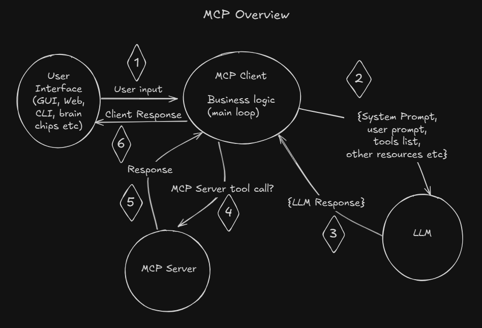

# Model Context Protocol Examples

This repository provides a comprehensive demonstration of Anthropic's Model Context Protocol (MCP) through two different implementation approaches: stdio communication and Server-Sent Events (SSE). These examples showcase how to create interactive AI applications that can dynamically access external tools and data sources.




## Prerequisites

- Ubuntu operating system or wsl
- Python 3.12.3
- pip (Python package installer)

## Setup

1. Clone this repository:

  ```
  git clone https://github.com/skywarditsolutions/JZ-Training-demo.git
```

  ```
  cd JZ-Training-demo
```

2. Create a new environment and install the required dependencies:

```
python3 -m venv venv
source venv/bin/activate
```
  ```
  pip install -r requirements.txt
```

3. Set up your environment variables:

```
cp env.example .env
```

Open the `.env` file and add your Bedrock API keys.

## Example 1: stdio

The stdio implementation demonstrates the Model Context Protocol using standard input/output streams for communication between the client and server components.

### How stdio Works
In this approach:

- Both client and server run within the same process but maintain separate logical components
- Communication happens through standard input/output streams
- The stdio_client.py file initiates the model and handles user interaction
- The stdio_server.py file implements the tools that the model can access
- Data is exchanged in a structured JSON format through stdin/stdout pipes

This implementation offers simplicity for development and debugging since both components run in the same process space. The client sends JSON messages to the server through stdout, and the server reads these messages from stdin. Responses flow back through the same channels.

Running the stdio example:

```
python stdio_client.py stdio_server.py
```

This command launches both client and server components, establishing a communication channel between them. The client manages the conversation loop with the language model, while the server provides tool functionality (such as document summarization) when requested.

## Example 2: Server-Sent Events (SSE) Implementation

The SSE implementation demonstrates a more distributed approach where client and server run as independent processes communicating over HTTP with Server-Sent Events.

### How SSE Works

Server-Sent Events (SSE) is a technology where a client receives automatic updates from a server via an HTTP connection. In this implementation:

- The server (sse_server.py) runs as a standalone HTTP server on port 5553
- The client (sse_client.py) connects to the server and establishes an event stream
- The client sends requests to the server via HTTP POST
- The server pushes responses back to the client through the established event stream
- Communication uses the same JSON protocol as the stdio example, but transported over HTTP

This approach allows for greater flexibility in deployment, as the client and server can run on different machines or even different platforms. It also enables horizontal scaling, as multiple clients can connect to a single server.

1. In one terminal, start the server:

```
python sse_server.py
```

2. In another terminal, start the client:

```
python sse_client.py
```

The client and server are configured to connect over `localhost:5553`.

## Technical Details

### Model Context Protocol Flow

1. User sends a message through the client interface
2. The language model (Claude) receives the message and evaluates whether it needs external data or tools
3. If a tool is needed, the model sends a structured request to the server
4. The server processes the request and returns results
5. The model incorporates the tool results into its response
6. The client displays the final response to the user
